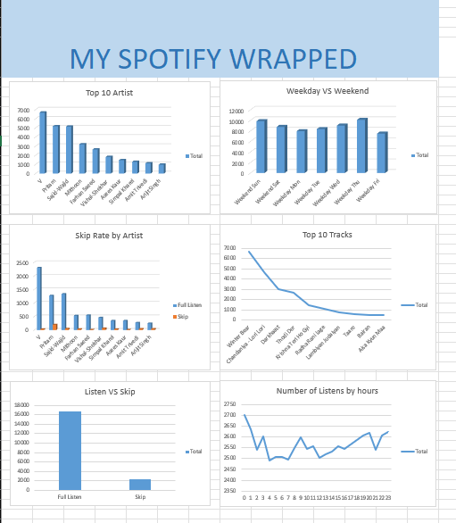

# My Spotify Wrapped — Listening Analytics Dashboard

A personal data project analyzing my own Spotify extended streaming history — cleaned, pivoted, and visualized in Excel to uncover real listening patterns.

## 📁 Workbook Structure
| Sheet | Purpose |
|---|---|
| raw_data1, raw_data2 | Original streaming history imported directly via Power Query from Spotify's extended history JSON export (kept separate as-received for transparency; combined total of 18,792 individual play events) |
| working sheet | Cleaned, appended data — parsed date/time, converted milliseconds to minutes, flagged skips vs. full listens, extracted hour and day-of-week |
| pivot table | Six breakdowns: top artists, top tracks, listening by hour, listening by day of week, skip rate by artist, weekday vs. weekend comparison |
| dashboard | Six PivotCharts summarizing the analysis in one view |

## 🔍 Key Insights
- **All-day listener, not a peak-time listener:** minutes played stay remarkably consistent across all 24 hours (~2,500–2,700 min/hour band) — no dramatic commute or bedtime spike, suggesting music runs in the background throughout the day rather than in bursts.
- **Weekends edge out weekdays, but not by much:** total weekday minutes are higher in raw sum (more days), but per-day listening is only modestly higher on weekends — consistent with an all-day listening habit rather than weekend-specific binge listening.
- **Full listens dominate:** the vast majority of plays are full listens rather than skips, meaning most tracks logged genuinely got listened through rather than scrolled past.
- **A small set of artists dominate total minutes:** the top artist alone accounts for well over 6,000 of the ~61,500 total minutes tracked — a clear personal favorite emerges even across 750+ unique artists played.
- **Track-level loyalty is concentrated too:** the top tracks list shows a steep drop-off after the top few songs, meaning a handful of tracks were played on repeat far more than the rest.

## 🛠️ Skills Used
- Power Query (JSON import, query appending, data transformation)
- Data cleaning (timestamp parsing, unit conversion, flag columns)
- PivotTables (multi-field grouping, value filters, custom grouping for weekday/weekend)
- PivotCharts and dashboard design

## 📊 Dashboard Preview

## 📌 Note
Data source: my own Spotify extended streaming history (requested via Spotify's account privacy settings), not a public/Kaggle dataset — analysis reflects real personal listening behavior.
